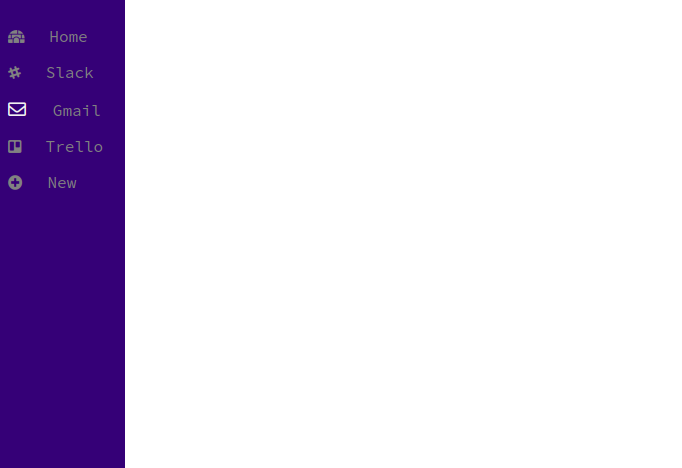

Created a navigation menu...

Next steps:
- embed webpages using electron
- dynamically add new links and remove previous links in the sidebar
- create a home page

The original goal was to have this project similar to Franz or Shift where you can centralize your workspace, but figuring out the security logistics is still a work in progress. It might transition into another kind of productivity app. 

