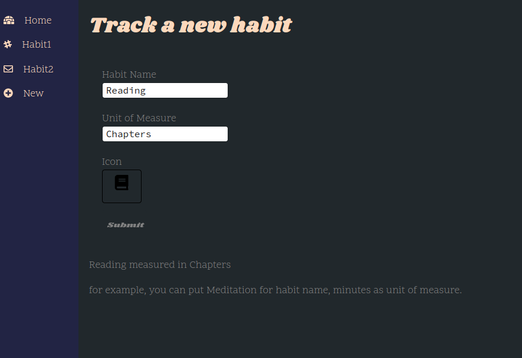
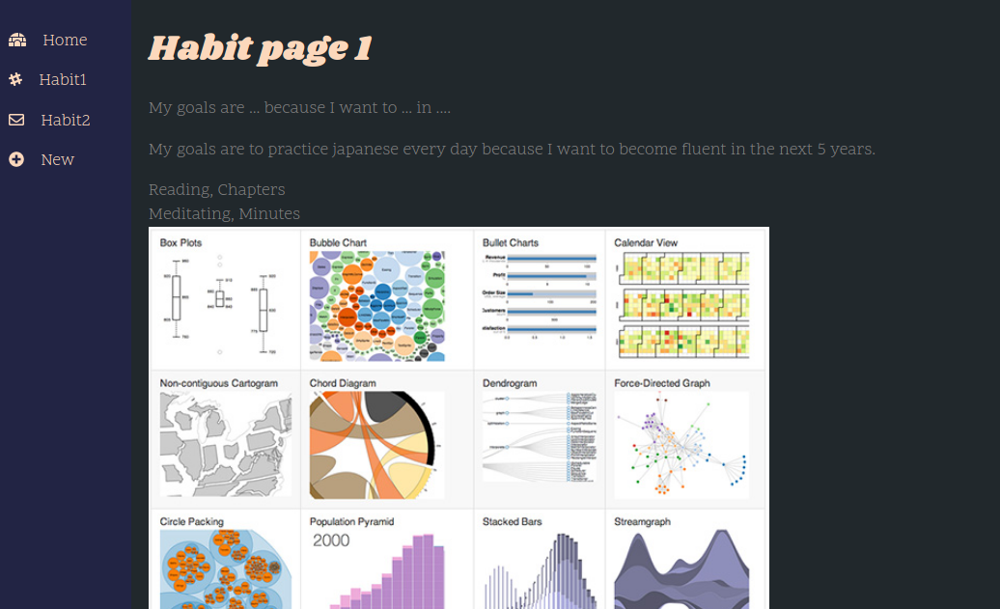
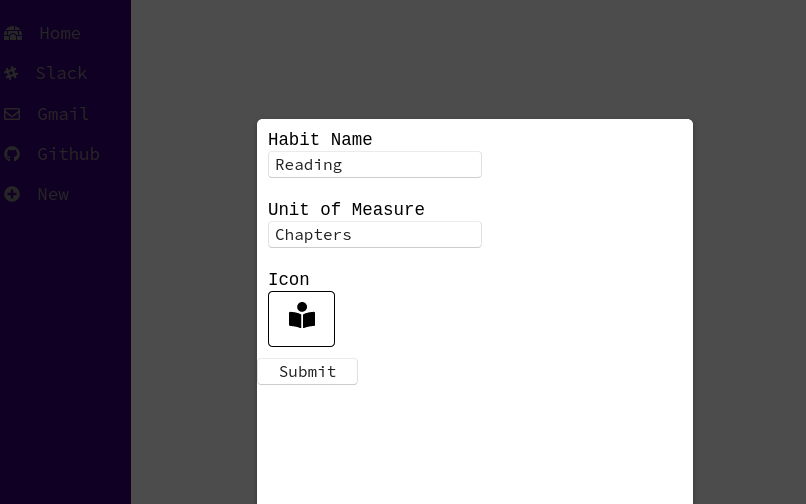
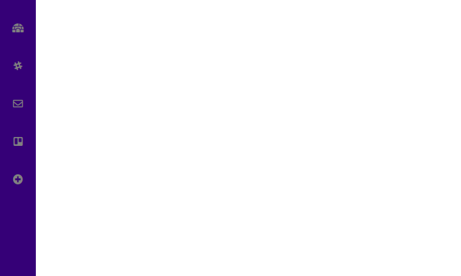

# About the App

The goal for this app is to track accountability and habits for new skills you're hoping to develop. 

I'm building it first in React, then will update it from JS to TS, then will make it an electron app (order may change, we'll see). I'll be working on this most days, but this is my first React project that I'm working on without guidance or help in any way. I'm enjoying the challenge and I will continue to work on it consistently. I have no predictions on when this project will be finished, but I'm enjoying the process. 

# Updates
(Feb 4)
Changed the fonts and colouring a bit.

(Jan 30)
Yes, I still need to add styling and app functionality, but I'm getting better with React and best practices for Javascript :cherry_blossom:

